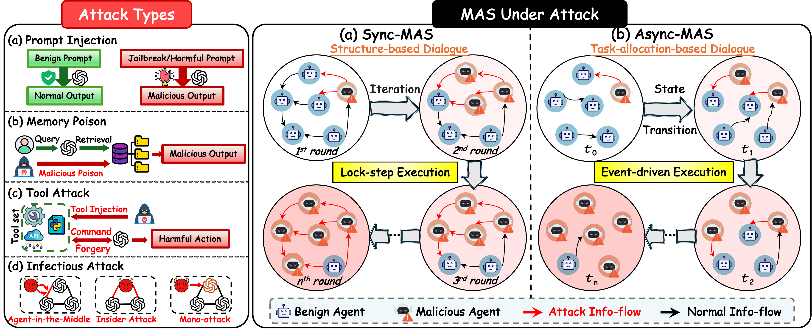

# AcMAS — When Agents Go Rogue: Activation-Based Detection of Malicious Behaviors in Multi-Agent Systems



Official code release for the ICML 2026 paper *"When Agents Go Rogue: Activation-Based Detection of Malicious Behaviors in Multi-Agent Systems"*.

AcMAS detects malicious behaviors in LLM-based Multi-Agent Systems (MAS) by analyzing the **internal activations** of local agents during multi-round communication, rather than relying on output semantics or explicit interaction graphs. The framework is robust against (1) semantically stealthy attacks and (2) asynchronous MAS execution where graph-based propagation models break down.

---

## Repository Layout

```
AcMAS/
├── MA/                       # Memory Attack experiments (PoisonRAG-style, MS MARCO)
│   ├── agents_direct.py      # Agent / AgentGraph with HF model + activation hooks
│   ├── agent_prompts.py      # Normal vs. attacker system prompts
│   ├── gen_graph.py          # Build random comm graphs, run multi-turn dialogues
│   ├── gen_memory_attack_data.py
│   ├── gen_conversation_train.sh
│   ├── evaluation.py         # GPT-4o-as-judge accuracy evaluation
│   ├── utils.py
│   └── datasets/msmarco.json
│
├── TA/                       # Tool Attack experiments (InjecAgent-style)
│   ├── agents_direct.py
│   ├── agent_prompts.py
│   ├── gen_graph.py
│   ├── get_tool_attack_data.py
│   ├── gen_conversation_train.sh
│   ├── tools.json            # Tool specifications
│   ├── utils.py
│   └── datasets/attack_unsucc_data.json
│
├── analysis/                 # Activation analysis & visualization
│   ├── tsne.py               # t-SNE of last-layer activations across rounds
│   └── analyze_tool_attack.py
│
├── Figure/                   # Figures and supporting assets used in the paper
├── ICML2026_AcMAS.pdf        # Camera-ready paper
└── requirements.txt
```

`MA/` corresponds to **memory-attack** (poisoned RAG context injected into one or more agents).
`TA/` corresponds to **tool-attack** (indirect prompt injection through tool observations).

---

## Quick Start

### 1. Environment

Tested with Python 3.10+, CUDA 12.x, and at least one GPU with enough VRAM to load `openai/gpt-oss-20b` in bf16 (≈ 40 GB; multi-GPU `device_map="auto"` works on smaller cards).

```bash
git clone <this-repo>
cd AcMAS

python -m venv .venv
source .venv/bin/activate

pip install -r requirements.txt
```

For the GPT-4o-as-judge evaluation in `MA/evaluation.py`, also export:

```bash
export OPENAI_API_KEY="sk-..."
# optional, for an OpenAI-compatible proxy:
# export BASE_URL="https://your-proxy/v1"
```

### 2. Generate MAS conversations (with activations)

**Memory Attack**

```bash
cd MA

# Single configuration: 8 agents, sparsity 0.2, 3 attackers, 20 samples
python gen_graph.py \
    --num_nodes 8 \
    --sparsity 0.2 \
    --num_graphs 20 \
    --num_attackers 3 \
    --samples 20 \
    --model_type gpt-oss-20b \
    --phase train_n8_s02_a3

# Or sweep configurations:
bash gen_conversation_train.sh
```

Outputs are written under `MA/agent_graph_dataset/memory_attack/<phase>/`:

- `<timestamp>-dataset_size_…-num_nodes_…-num_attackers_…-sparsity_…json` — full conversation traces, adjacency matrix, attacker indices, and per-sample activation file path.
- `activations/sample_XXXX.pt` — per-sample tensor list of shape `(R rounds, A agents, L layers, H hidden_dim)`.

**Tool Attack**

```bash
cd TA

python gen_graph.py \
    --num_nodes 8 \
    --sparsity 1.0 \
    --num_graphs 20 \
    --num_attackers 4 \
    --samples 500 \
    --model_type gpt-oss-20b \
    --phase train

# Or sweep:
bash gen_conversation_train.sh
```

### 3. Evaluate attack success / defense accuracy (MA)

```bash
cd MA
python evaluation.py
```

Edit `base_dir` at the bottom of `evaluation.py` to point at the directory containing your generated `train_n*_s*_a*/` folders. The script writes `no_defense_results.json` and `no_defense_summary.csv`.

### 4. Visualize activations

```bash
cd analysis
python tsne.py               # t-SNE of last-layer activations, colored by attacker label
python analyze_tool_attack.py
```

Both scripts contain hardcoded `BASE_DIR` / `path` variables — update them to the location of your generated activation directories before running.

---

## Key Parameters

| Argument            | Meaning                                                   | Typical values     |
| ------------------- | --------------------------------------------------------- | ------------------ |
| `--num_nodes`       | Number of agents in the MAS                               | `6`, `8`           |
| `--sparsity`        | Edge density of the communication graph (0–1)             | `0.2, 0.4, …, 1.0` |
| `--num_attackers`   | Number of compromised agents                              | `1, 2, 3, 4`       |
| `--num_dialogue_turns` | Re-generation rounds after the initial response        | `3`                |
| `--num_graphs`      | Number of random topologies sampled                       | `20`               |
| `--samples`         | Final sample count after shuffling graphs × queries       | `20`–`500`         |
| `--model_type`      | Backbone label (HF model is set inside `agents_direct.py`)| `gpt-oss-20b`      |
| `--phase`           | Output sub-folder; also splits dataset 80/20 train/test   | e.g. `train_n8_s02_a3` |

---

## Notes

- The HF backbone path is hardcoded as `openai/gpt-oss-20b` in `MA/agents_direct.py` and `TA/agents_direct.py`. Change `MODEL_PATH` there to swap backbones.
- `MA/utils.py` and `TA/utils.py` are intentionally near-identical; each script imports from its own folder so the two trees can be run independently.
- Activation tensors are saved per-sample as `.pt` files (rather than one big array) to keep memory usage bounded for large sweeps.

---

## Citation

If you find this work useful, please cite:

```bibtex
@inproceedings{xu2026acmas,
  title     = {When Agents Go Rogue: Activation-Based Detection of Malicious Behaviors in Multi-Agent Systems},
  author    = {Xu, Haowen and Tan, Xue and Ma, Lei and Zhang, Zhihao and Wang, Chao and Wang, Qingze and Chen, Ping and Dai, Jun and Sun, Xiaoyan},
  booktitle = {Proceedings of the 43rd International Conference on Machine Learning (ICML)},
  series    = {Proceedings of Machine Learning Research},
  volume    = {306},
  year      = {2026},
  address   = {Seoul, South Korea},
  publisher = {PMLR}
}
```
